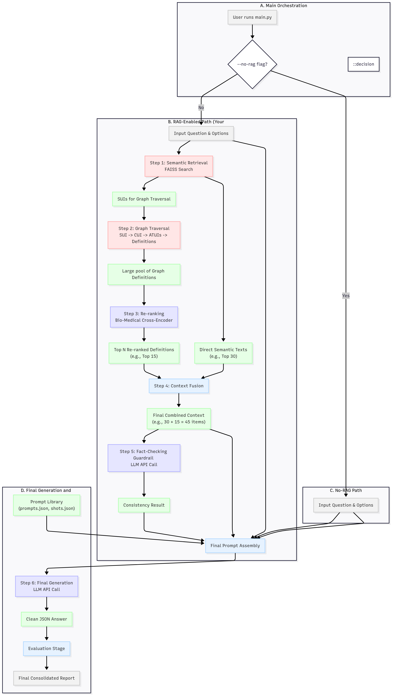

# MedKG-Eval: A Medical Knowledge Graph RAG Evaluation Framework

MedKG-Eval is a comprehensive pipeline designed to evaluate the reasoning capabilities of Large Language Models (LLMs) on complex medical questions. It leverages a custom Knowledge Graph built with NebulaGraph to provide contextually relevant information to the models, a technique known as Retrieval-Augmented Generation (RAG).

The framework is built for rigorous experimentation, allowing for side-by-side comparisons of different LLMs, A/B testing of prompt templates, and direct evaluation of the RAG pipeline's impact versus the models' raw knowledge.

---

## Features

-   **Multi-Model Evaluation:** Run experiments on multiple LLMs (e.g., `deepseek-r1:14b`, `llama3.2:latest`) simultaneously and compare their performance in a single, consolidated report.
-   **Hybrid RAG Pipeline:** Implements a state-of-the-art, multi-stage retrieval process that combines fast semantic search with structured knowledge graph traversal.
-   **RAG vs. No-RAG Mode:** A simple command-line flag (`--no-rag`) allows you to run the same experiments with the entire RAG pipeline disabled, providing a clear baseline of the LLM's intrinsic knowledge.
-   **Task-Specific Evaluation:** Includes specialized evaluation logic for different types of reasoning tasks, such as factual recall (`reasoning_fct`) and absurdity detection (`reasoning_fake`).
-   **Robustness and Reliability:** Features an intelligent fact-checking layer for fake questions and a resilient, multi-retry mechanism for handling unreliable LLM outputs.
-   **Detailed Debugging Tools:** Comes with Jupyter Notebooks for deep-dive analysis of retrieval quality using Cross-Encoder relevance scoring.

---

## Architecture Overview

The power of this framework comes from its sophisticated, multi-stage RAG pipeline. When RAG is enabled, the system follows this process for each question:

#### The Librarian Analogy
Imagine asking a highly skilled medical librarian a question. They don't just guess the answer. Instead, they:
1.  **Understand the core concept** of your question (Semantic Search).
2.  **Use the card catalog** to find explicitly linked articles and definitions based on that concept (Graph Traversal).
3.  **Combine and review all retrieved documents**, selecting only the most relevant pages to give you (Re-ranking & Context Fusion).
4.  **Finally, use this focused information** to formulate the answer.

This is exactly how the MedKG-Eval pipeline operates.



#### Technical Flow

1.  **Semantic Retrieval (`retrieve_semantic_nodes`)**: The user's question is converted into a vector embedding. **FAISS** is used to find the `top_k` most semantically similar nodes from the knowledge base. This returns both the `SUIs` (for graph traversal) and the direct semantic text of the most similar nodes.

2.  **Graph Traversal (`get_definitions_from_graph`)**: The retrieved `SUIs` are used as entry points into the **NebulaGraph** database. The pipeline traverses the graph from these semantic nodes to their connected concept nodes (`CUIs`) and finally to their associated definition ids (`ATUIs`) to fetch structured, related definitions.

3.  **Re-ranking (`rerank_definitions`)**: This large pool of definitions is scored for relevance against the original question using a powerful, domain-specific **Bio-Medical Cross-Encoder** (`pritamdeka/S-PubMedBert-MS-MARCO`) and the top n definitions are retrieved for context building. This ensures that the final context is not only topically related but also highly precise.

3.  **Context Fusion**: The context from the direct semantic text (Step 1) and the reranked definitions (Step 3) are combined into a single, rich pool of candidate documents.

5.  **Fact-Checking Guardrail**: For tasks designed to be nonsensical, a preliminary check (`check_premise_consistency`) is performed. An LLM is asked if the retrieved context supports the question's premise. If it returns `CONTRADICTED` or `NEUTRAL`, the pipeline knows the question is flawed.

6.  **Final Generation (`generate_llm_response`)**: The top 45 highest-scoring context sentences (30 semantic texts + 15 re-ranked definitions) are combined with few-shot examples and strong instructions, and sent to the final LLM (e.g., `llama3.2:latest`) to generate the structured JSON answer.

#### No-RAG Mode
When the `--no-rag` flag is used, Steps 1-5 are completely bypassed. The LLM receives only the question, options, and few-shot examples, forcing it to rely solely on its internal, pre-trained knowledge.

---

## Project Structure
```
medkg-eval/
├── data/ # Input CSV datasets (fct, fake, nota)
├── prompt_library/ # Contains prompts.json and shots.json for each task
├── RAG_pipeline/
│ ├── utils.py # Core helper functions (retrieval, graph traversal, LLM calls)
│ └── generator.py # The RAGGenerator class that orchestrates the pipeline
├── evaluation/
│ ├── evaluator.py # The FullDataEval class for scoring results
│ └── utils.py # Helper functions for cleaning prediction outputs
├── graph_rag/ # (External) Location of FAISS index and semantic nodes
│ ├── faiss_index.bin
│ └── semantic_nodes.json
├── main.py # Main script to run the entire pipeline
├── debug_rag_pipeline.ipynb # Jupyter notebook for interactive debugging
├── relevance_analysis.ipynb # Notebook for analyzing context quality with a Cross-Encoder
├── requirements.txt # All Python dependencies
└── .env # API keys and base URLs (MUST NOT be committed to Git)
```

---

## Setup and Installation

1.  **Prerequisites:**
    *   Python 3.9+
    *   A running NebulaGraph instance accessible at `127.0.0.1:9669`.
    *   An API endpoint for your LLMs (e.g., a local Ollama server or a cloud provider).

2.  **Clone the Repository:**
    ```bash
    git clone https://github.com/acharya221b/medkg-eval.git
    cd medkg-eval
    ```

3.  **Create and Activate a Virtual Environment:**
    ```bash
    python3 -m venv venv
    source venv/bin/activate
    ```

4.  **Configure API Credentials:**
    *   Create a file named `.env` in the root of the project.
    *   Add your API endpoint URL and secret key.
    *   **Example for a local Ollama server:**
        ```
        OPENAI_BASE_URL="http://localhost:11434/v1"
        API_KEY="ollama"
        ```
    *   **Example for a remote API:**
        ```
        OPENAI_BASE_URL="https://ollama.zib.de/api"
        API_KEY="sk-your-secret-api-key"
        ```
    *   **IMPORTANT:** Ensure `.env` is listed in your `.gitignore` file to protect your secrets.

---

## How to Run

The main script `main.py` is controlled via command-line arguments.

#### Key Arguments:
*   `--models`: (Required) A list of one or more model names to evaluate (e.g., `llama3.2:latest deepseek-r1:14b`).
*   `--tasks`: (Required) A list of one or more tasks to run (e.g., `reasoning_fct reasoning_fake`).
*   `--prompt_id`: The prompt version to use from `prompts.json` (default: `v0`).
*   `--max_shots`: The number of few-shot examples to include in the prompt (default: `3`).
*   `--no-rag`: If present, disables the entire RAG pipeline.
*   `--skip-predictions`: Skips the prediction stage and runs only the conversion and evaluation on existing files.
*   `--force-rerun`: Forces regeneration of prediction files even if they already exist.

#### Example Commands:

*   **Run a single task with a single model using the RAG pipeline:**
    ```bash
    python main.py --tasks reasoning_fct --models "deepseek-r1:14b"
    ```

*   **Compare two models on two tasks using a specific prompt and 1 shot:**
    ```bash
    python main.py --tasks reasoning_fct reasoning_fake --models "deepseek-r1:14b" "llama3.2:latest" --prompt_id v1 --max_shots 1
    ```

*   **Run a NO-RAG baseline to test the LLM's raw knowledge:**
    ```bash
    python main.py --tasks reasoning_fct --models "deepseek-r1:14b" --no-rag
    ```

---

## Debugging and Analysis

Low accuracy is not a bug; it's a signal that the pipeline needs tuning. Use the provided Jupyter Notebooks to diagnose issues.

*   **`debug_rag_pipeline.ipynb`**: The main interactive tool. Load a single failed question and run the RAG pipeline step-by-step to inspect the retrieved context at each stage. Get a definitive, quantitative score of how relevant your retrieved definitions are to a given question. 

---

## Output

The pipeline generates output in separate directories to keep experiments organized.

*   **`predictions/` & `results/`**: Used for standard RAG runs.
*   **`predictions_no_rag/` & `results_no_rag/`**: Used for `--no-rag` runs.

Inside these folders, you will find:
*   **Prediction CSVs:** Raw outputs from the LLM for each model/task combo.
    *   `..._predictions_prompt_v0_model_gpt-4o-mini.csv`
*   **Result JSONs:** Cleaned and merged data ready for evaluation.
    *   `..._prompt_v0_model_gpt-4o-mini.json`
*   **Final Report CSV:** The final, consolidated report comparing all models and tasks in the experiment.
    *   `final_report_prompt_v0_tasks_reasoning_fct_reasoning_fake.csv`